# FlutterTest AI

**Generate, run, and repair Flutter tests automatically.**

A local-first CLI that analyzes Flutter apps and generates conservative, runnable tests — no API key required.


[](https://pub.dev/packages/fluttertest_ai)
[](https://pub.dev/packages/fluttertest_ai)

## Why FlutterTest AI?

FlutterTest AI scans your Flutter project, detects its state-management approach, and generates runnable unit and widget tests. It works entirely locally — no cloud service, no API key, no configuration files needed.

- **Zero setup**: just `dart pub global activate` and run
- **State-aware**: detects setState, Provider, Riverpod, BLoC/Cubit, GetX, Redux, MobX, ValueNotifier, Signals, and more
- **Safe by default**: never modifies `lib/`, never overwrites handwritten tests
- **Privacy-first**: all analysis happens locally; no source code leaves your machine

## Installation

### From pub.dev (recommended)

```bash
dart pub global activate fluttertest_ai
```

### From source

```bash
git clone https://github.com/Raghavaraju-K/fluttertest_ai.git
cd fluttertest_ai
dart pub global activate --source path .
```

## Quick Start

```bash
cd my_flutter_app

# Verify your environment and project
fluttertest-ai doctor

# Analyze the project and see what will be tested
fluttertest-ai analyze

# Generate tests
fluttertest-ai generate

# Run the generated tests
fluttertest-ai run

# Fix any failing generated tests
fluttertest-ai fix

# Generate reports
fluttertest-ai report
```

### Example Output

Output from `fluttertest-ai analyze` on a Riverpod app:

```text
Analyzing Flutter project...
State management: Riverpod (100% confidence, adapter: riverpodAdapter)
  dependency: flutter_riverpod
  import: package:flutter_riverpod
  class inheritance: CounterPage extends ConsumerWidget
```

Output from `fluttertest-ai analyze` on a default `flutter create` app:

```text
Analyzing Flutter project...
State management: setState (85% confidence)
  behavior: setState() called in 1 file(s)
  class inheritance: _MyHomePageState extends State
```

Output from `fluttertest-ai generate` and `fluttertest-ai run`:

```text
Generating tests...
✓ test/counter_widget_test.dart
✓ test/core/validators_test.dart

Running generated tests...
✓ 41 passed
```

## Supported State Management

| Framework | Detection Method | Generation |
| --- | --- | --- |
| setState | `setState()` calls, `State` inheritance | State-aware generation |
| Provider / ChangeNotifier | Dependency, imports, inheritance | State-aware generation, `MultiProvider` harness |
| Riverpod | Dependency, imports, `Consumer`/`ConsumerWidget` inheritance | State-aware generation, `ProviderScope` harness |
| BLoC / Cubit | Dependency, imports, inheritance | State-aware generation, `BlocProvider` harness |
| GetX | Dependency, imports, `GetBuilder` usage | Conservative generic fallback |
| Redux | Dependency, imports, `StoreConnector` usage | Conservative generic fallback |
| MobX | Dependency, imports, `Observer` usage | Conservative generic fallback |
| ValueNotifier / ValueListenableBuilder | Dependency, imports, `ValueListenableBuilder` usage | State-aware generation |
| Signals | Dependency, imports | Conservative generic fallback |
| Unknown / custom | Absence of known evidence | Conservative generic fallback |

## How It Works

```mermaid
flowchart LR
  A[Detect project] --> B[Analyze: analyzer AST]
  B --> C[Detect state management]
  C --> D[Select adapter]
  D --> E[Build test plan]
  E --> F[Generate: unit / widget]
  F --> G[Run via flutter test]
  G --> H[Parse failures]
  H --> I[Repair generated tests]
  I --> J[Report]
```



1. **Detect project**: confirms the current directory is a Flutter project and reads `pubspec.yaml`
2. **Analyze**: uses the Dart `analyzer` package to parse source files into an AST
3. **Detect state management**: matches structured evidence (dependency names, `package:` imports, class inheritance, widget usage, behavior) and computes a confidence score
4. **Select adapter**: picks the matching state-management adapter, or the generic adapter for unknown/custom state management
5. **Build test plan**: decides which files get unit and/or widget tests, at which confidence, and records skip reasons for files it will not touch
6. **Generate**: writes unit tests for pure functions, validators, formatters, JSON models, and utility classes; writes widget tests asserting real UI signals (`find.text`, `find.byKey`, `find.byType`) wrapped in the adapter's harness
7. **Run**: executes generated tests via `flutter test`
8. **Parse failures**: reads `flutter test` output to classify failures
9. **Repair**: applies deterministic fixes to generated tests only (missing imports, harness wrappers, finder issues), then re-runs them
10. **Report**: writes sanitized Markdown and JSON reports under `.fluttertest_ai/`

## Generic Fallback

For projects with unknown or custom state management, FlutterTest AI generates conservative behavior-based tests instead of state-aware ones:

- Widget renders without crashing
- Important content is visible
- Form validation works
- Buttons become enabled/disabled correctly
- Public user actions lead to visible expected results
- Loading/error states render correctly

Tests are based on public UI signals (text, buttons, keys, forms) rather than private implementation details, so the fallback stays safe even when the underlying state-management approach is not recognized.

## Safety and Privacy

### What FlutterTest AI does:
- Reads your project's Dart files for analysis
- Writes generated tests under `test/`
- Writes reports under `.fluttertest_ai/`
- Runs `flutter test` locally

### What FlutterTest AI never does:
- Modifies files under `lib/`
- Overwrites handwritten test files
- Transmits source code externally (by default)
- Adds dependencies to `pubspec.yaml`
- Claims a test passed unless `flutter test` succeeded

### Privacy

FlutterTest AI is local-first: analysis, generation, execution, and repair all run on your machine, with no network calls. The default AI provider (`DisabledAiProvider`) is disabled and returns no suggestions. Environment-variable values are redacted from saved test output.

### Optional AI provider (opt-in, currently inert)

An `AiProvider` interface exists as an extension point. Two implementations ship today:

- `DisabledAiProvider` — the default. Always disabled, returns no suggestions.
- `OpenAiCompatibleProvider` — opt-in via the `FLUTTERTEST_AI_ENABLE_EXTERNAL_AI` environment variable. Setting it does not enable any network behaviour: this implementation is currently an inert stub that performs no network calls and always returns an empty suggestion list. It is not wired into any command, so no command's behaviour changes whether or not it is enabled. Treat it as a placeholder for future work, not a working AI feature.

## Limitations and Non-Goals

- Generated tests are heuristics and always need human review
- No visual regression testing
- No native iOS/Android dialog testing
- Never modifies production application code under `lib/`
- Not every generated test is guaranteed to be logically correct — review before relying on it
- Complex dependency injection and repository I/O (classes matching `Repository`/`Service` naming, or importing packages like `http`/`sqflite`) are intentionally skipped, with the reason recorded
- Not every custom state-management solution is supported; unsupported approaches fall back to the conservative generic adapter
- Detection covers every listed framework, but deeper state-aware harness wrapping is currently implemented for Riverpod only (`ProviderScope`). Other frameworks are detected correctly and generate tests through the generic harness
- `generate --type integration` writes to `integration_test/`, which `run` and `fix` do not scan. Execute those with `flutter test integration_test/` directly. The test is skipped entirely, with a reason, when the `integration_test` dependency is absent
- No required cloud service — everything runs locally

## Requirements

- Dart SDK `>=3.4.0 <4.0.0`
- Flutter (for running generated tests)
- Windows, macOS, or Linux

## Configuration

No configuration file is required. All options are passed via command-line flags:

| Flag | Command | Description |
| --- | --- | --- |
| `--json` | `analyze`, `generate` | Output in JSON format |
| `--type` | `generate` | Test type: `unit`, `widget`, `integration` |
| `--dry-run` | `generate` | Preview without writing files |
| `--force` | `generate` | Refresh previously generated tests |

## Commands

### `fluttertest-ai doctor`

Verifies your environment:
- Flutter and Dart are installed
- Current directory is a Flutter project
- Shows Flutter version, Dart version, project name, and detected state management

```bash
fluttertest-ai doctor
```

### `fluttertest-ai analyze [path]`

Analyzes the project and prints a test plan:
- Reads `pubspec.yaml` for dependencies
- Scans Dart files under `lib/` using the Dart analyzer
- Detects widgets, logic classes, validators, services, and state management
- Identifies existing tests

```bash
fluttertest-ai analyze
fluttertest-ai analyze path/to/project
fluttertest-ai analyze --json   # Machine-readable output
```

### `fluttertest-ai generate [path]`

Generates tests for files without equivalent tests:
- Default output: `test/` directory
- Never overwrites handwritten tests
- Adds ownership marker to generated files

```bash
fluttertest-ai generate
fluttertest-ai generate --type unit
fluttertest-ai generate --type widget
fluttertest-ai generate --type integration
fluttertest-ai generate --dry-run    # Preview without writing
fluttertest-ai generate --force      # Refresh previously generated tests
fluttertest-ai generate --json       # Machine-readable output
```

### `fluttertest-ai run`

Runs generated tests through `flutter test`:
- Only executes files with the generated ownership marker
- Shows passed, failed, skipped, and compilation-error counts
- Stores sanitized reports under `.fluttertest_ai/runs/`

```bash
fluttertest-ai run
```

### `fluttertest-ai fix`

Repairs failing generated tests:
- Reads failures from the most recent run
- Applies deterministic fixes (missing imports, harness wrappers, etc.)
- Re-runs repaired tests
- Stops after three attempts by default

```bash
fluttertest-ai fix
```

### `fluttertest-ai report`

Generates Markdown and JSON reports:
- Detected state manager
- Analyzed files and generated tests
- Test results and confidence scores
- Skipped files with reasons

```bash
fluttertest-ai report
```

## Contributing

Contributions are welcome! See [CONTRIBUTING.md](CONTRIBUTING.md) for guidelines.

## Roadmap

- Richer safe fakes for dependency injection
- More adapter-aware test harnesses
- Opt-in AI provider transports with explicit source-sharing consent
- Support for more state-management libraries
- Improved confidence scoring

## License

[MIT License](LICENSE)
