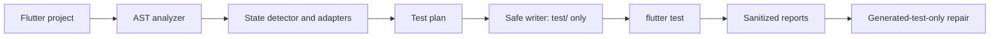

# FlutterTest AI

**A local-first CLI that analyzes Flutter apps and generates conservative, runnable tests — no API key required.**


[](https://pub.dev/packages/fluttertest_ai)
[](https://pub.dev/packages/fluttertest_ai)

## Why FlutterTest AI?

FlutterTest AI scans your Flutter project, detects its state-management approach, and generates runnable unit and widget tests. It works entirely locally — no cloud service, no API key, no configuration files needed.

- **Zero setup**: just `dart pub global activate` and run
- **State-aware**: detects Riverpod, BLoC, Provider, GetX, Redux, MobX, and more
- **Safe by default**: never modifies `lib/`, never overwrites handwritten tests
- **Privacy-first**: all analysis happens locally; no source code leaves your machine
## Installation

### From pub.dev (recommended)

```bash
dart pub global activate fluttertest_ai
```

### From source

```bash
git clone https://github.com/example/fluttertest_ai.git
cd fluttertest_ai
dart pub global activate --source path .
```

## Quick Start

```bash
cd my_flutter_app

# Verify your environment and project
fluttertest-ai doctor

# Analyze the project and see what will be tested
fluttertest-ai analyze

# Generate tests
fluttertest-ai generate

# Run the generated tests
fluttertest-ai run

# Fix any failing generated tests
fluttertest-ai fix

# Generate reports
fluttertest-ai report
```

### Example Output

```text
FlutterTest AI v0.1.0

Analyzing Flutter project...
✓ Flutter project detected
✓ State management: Riverpod
✓ Screens detected: 8
✓ Testable classes detected: 23
✓ Existing tests found: 7

Generating tests...
✓ test/features/auth/login_screen_test.dart
✓ test/features/auth/auth_notifier_test.dart
✓ test/core/email_validator_test.dart
## Commands

### `fluttertest-ai doctor`

Verifies your environment:
- Flutter and Dart are installed
- Current directory is a Flutter project
- Shows Flutter version, Dart version, project name, and detected state management

```bash
fluttertest-ai doctor
```

### `fluttertest-ai analyze [path]`

Analyzes the project and prints a test plan:
- Reads `pubspec.yaml` for dependencies
- Scans Dart files under `lib/` using the Dart analyzer
- Detects widgets, logic classes, validators, services, and state management
- Identifies existing tests

```bash
fluttertest-ai analyze
fluttertest-ai analyze path/to/project
fluttertest-ai analyze --json   # Machine-readable output
```

### `fluttertest-ai generate [path]`

Generates tests for files without equivalent tests:
- Default output: `test/` directory
- Never overwrites handwritten tests
- Adds ownership marker to generated files

```bash
fluttertest-ai generate
fluttertest-ai generate --type unit
fluttertest-ai generate --type widget
fluttertest-ai generate --type integration
fluttertest-ai generate --dry-run    # Preview without writing
fluttertest-ai generate --force      # Refresh previously generated tests
fluttertest-ai generate --json       # Machine-readable output
```

### `fluttertest-ai run`

Runs generated tests through `flutter test`:
- Only executes files with the generated ownership marker
- Shows passed, failed, skipped, and compilation-error counts
- Stores sanitized reports under `.fluttertest_ai/runs/`

```bash
fluttertest-ai run
```

### `fluttertest-ai fix`

Repairs failing generated tests:
- Reads failures from the most recent run
- Applies deterministic fixes (missing imports, harness wrappers, etc.)
- Re-runs repaired tests
- Stops after three attempts by default

```bash
fluttertest-ai fix
```

### `fluttertest-ai report`

Generates Markdown and JSON reports:
- Detected state manager
- Analyzed files and generated tests
## Supported State Management

| Framework | Detection Method | Test Harness |
| --- | --- | --- |
| setState | Widget usage, `setState` calls | Conservative widget harness |
| Provider / ChangeNotifier | Dependency, imports, inheritance | `MultiProvider` harness |
| Riverpod | Dependency, imports, Consumer widgets | `ProviderScope` harness |
| BLoC / Cubit | Dependency, imports, inheritance | `BlocProvider` harness |
| GetX | Dependency, imports, `GetBuilder` | Conservative fallback |
| Redux | Dependency, imports, `StoreConnector` | Conservative fallback |
| MobX | Dependency, imports, `Observer` | Conservative fallback |
| ValueNotifier | Dependency, imports, `ValueListenableBuilder` | Conservative fallback |
| Signals | Dependency, imports | Conservative fallback |
| Custom / unknown | Absence of known evidence | Behavior-based fallback |

## How It Works



1. **AST Analysis**: Uses the Dart `analyzer` package to parse source code and inspect AST nodes
2. **State Detection**: Identifies state management from `pubspec.yaml`, imports, inheritance, and widget usage
3. **Test Planning**: Builds a conservative test plan with confidence scores
4. **Safe Generation**: Writes tests only under `test/`, never touching `lib/` or handwritten tests
5. **Execution**: Runs tests through `flutter test` and captures results
6. **Repair**: Applies deterministic fixes to generated tests only

## Safety and Privacy

### What FlutterTest AI does:
- Reads your project's Dart files for analysis
- Writes generated tests under `test/`
- Writes reports under `.fluttertest_ai/`
- Runs `flutter test` locally

### What FlutterTest AI never does:
- Modifies files under `lib/`
- Overwrites handwritten test files
- Transmits source code externally (by default)
- Adds dependencies to `pubspec.yaml`
- Claims a test passed unless `flutter test` succeeded

### Privacy

The default AI provider is disabled. No source code leaves your machine. An OpenAI-compatible provider is available as an opt-in extension point but requires explicit configuration. Environment-variable values are redacted from saved test output.

## Generic Fallback

For projects with unknown or custom state management, FlutterTest AI generates conservative behavior-based tests:

- Widget renders without crashing
- Important content is visible
- Form validation works
- Buttons become enabled/disabled correctly
- Public user actions lead to visible expected results
- Loading/error states render correctly

Tests are based on public UI signals (text, buttons, keys, forms) rather than private implementation details.

## Configuration

No configuration file is required. All options are passed via command-line flags:

| Flag | Command | Description |
| --- | --- | --- |
| `--json` | `analyze`, `generate` | Output in JSON format |
| `--type` | `generate` | Test type: `unit`, `widget`, `integration` |
| `--dry-run` | `generate` | Preview without writing files |
| `--force` | `generate` | Refresh previously generated tests |

## Limitations and Non-Goals

- Generated tests are heuristics and always need human review
- v0.1 has no visual regression testing
- No native iOS/Android dialog testing
- No modification of production app code
- Complex dependency injection and repository I/O are intentionally skipped
- Not every custom state-management solution is supported

## Requirements

- Dart SDK `>=3.4.0 <4.0.0`
- Flutter (for running generated tests)
- Windows, macOS, or Linux

## Contributing

Contributions are welcome! See [CONTRIBUTING.md](CONTRIBUTING.md) for guidelines.

## Roadmap

- Richer safe fakes for dependency injection
- More adapter-aware test harnesses
- Opt-in AI provider transports with explicit source-sharing consent
- Support for more state-management libraries
- Improved confidence scoring

## License

[MIT License](LICENSE)

- Test results and confidence scores
- Skipped files with reasons

```bash
fluttertest-ai report
```


Running generated tests...
✓ 18 passed
✗ 2 failed

Repairing generated tests...
✓ Fixed missing ProviderScope override
✓ Re-ran tests: 20 passed
```

